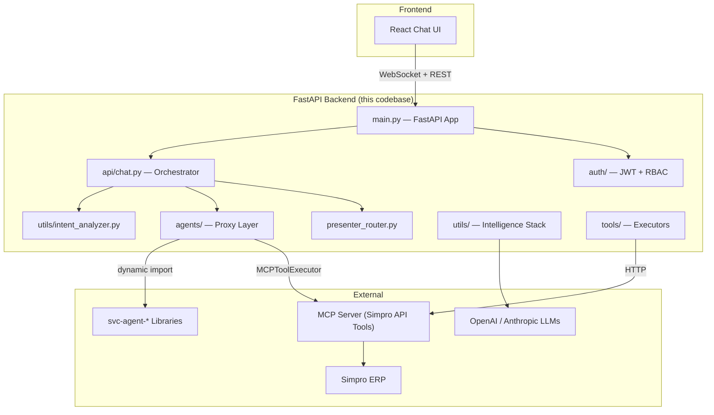
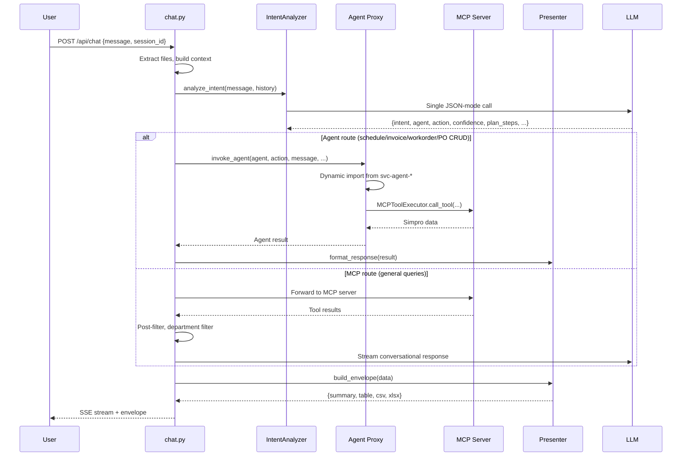
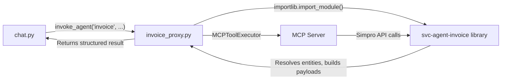
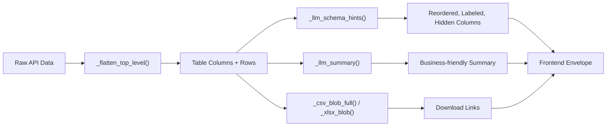

# Optificial.AI — Backend Architecture Deep-Dive

> **Scope**: `Chatbox_mcp/backend/` — the FastAPI server that powers the AI chatbot for construction back-office automation on top of Simpro ERP.

---

## 1. Executive Summary

The backend is a **multi-tenant, agent-orchestrated AI platform** built with FastAPI. It receives natural-language user messages, classifies intent via LLM, routes requests to specialized domain agents (schedule, invoice, workorder, purchase order), and executes CRUD operations against Simpro ERP through an external MCP (Model Context Protocol) server. The system includes a full multi-tenant auth/RBAC layer, LLM-powered decision-making at every ambiguity point, PII filtering, usage metering, and a presentation layer that formats raw API data into rich frontend envelopes.



---

## 2. Directory Structure & Significance

| Path | Files | Purpose |
|------|-------|---------|
| [main.py](file:///c:/Users/91970/Downloads/Optificial.AI-master/Optificial.AI-master/Chatbox_mcp/backend/main.py) | 1 | FastAPI entry point, middleware, startup migrations |
| [personality.py](file:///c:/Users/91970/Downloads/Optificial.AI-master/Optificial.AI-master/Chatbox_mcp/backend/personality.py) | 1 | Personality presets & prompt compiler for AI voice |
| [presenter_router.py](file:///c:/Users/91970/Downloads/Optificial.AI-master/Optificial.AI-master/Chatbox_mcp/backend/presenter_router.py) | 1 | Output formatting: tables, summaries, CSV/Excel export |
| **api/** | 6 | HTTP endpoint handlers |
| **agents/** | 5 | Agent registry + proxy modules per domain |
| **auth/** | 2 | JWT auth, SQLite database, RBAC |
| **utils/** | 35 | Intelligence stack: LLM, intent, crossroads, entity resolution, fuzzy matching, PII, context, etc. |
| **tools/** | 6 | MCP tool executors + template generators |
| **analysis/** | 1 | Query complexity analyzer for LLM routing |
| **scripts/** | 1 | One-time migration utilities |

---

## 3. Core Application Layer

### 3.1 Entry Point — [main.py](file:///c:/Users/91970/Downloads/Optificial.AI-master/Optificial.AI-master/Chatbox_mcp/backend/main.py)

- Creates the FastAPI app with CORS middleware (allows all origins for dev)
- Mounts sub-routers: `/api/auth/`, `/api/superadmin/`, `/api/` (presenter), `/api/` (chat), `/api/` (analysis), `/api/` (agent-handoff)
- **Startup event**: Runs `ensure_department_mapping_migration()` to bootstrap per-org department mappings from the legacy `department_mapping.json`
- **Key config**: Reads `.env` for all secrets (LLM keys, Simpro creds, JWT secrets, superadmin token)

### 3.2 Personality System — [personality.py](file:///c:/Users/91970/Downloads/Optificial.AI-master/Optificial.AI-master/Chatbox_mcp/backend/personality.py)

Defines how the AI assistant communicates. Uses a **preset-based architecture**:

| Concept | Description |
|---------|-------------|
| **Presets** | Named personality configs (e.g., `"advisor"`) with temperature, tone, formatting rules |
| **Prompt Blocks** | `compile_personality_block(context)` generates context-specific system prompts — `"chat"` for conversational responses, `"summary"` for data summarization |
| **Temperature** | Different temperatures for narrative (`0.15`) vs deterministic (`0.0`) outputs |

---

## 4. API Layer (`api/`)

### 4.1 The Orchestrator — [api/chat.py](file:///c:/Users/91970/Downloads/Optificial.AI-master/Optificial.AI-master/Chatbox_mcp/backend/api/chat.py) (~1200 lines)

> **This is the heart of the system.** Every user message flows through here.



**Key responsibilities:**

| Function | Purpose |
|----------|---------|
| `handle_chat_message()` | Main entry — auth, session management, file extraction, routing |
| `_analyze_and_route()` | Intent analysis → agent or MCP path |
| `_invoke_agent()` | Calls agent proxy, handles clarification loops, multi-action orchestration |
| `_handle_mcp_path()` | For read-only queries — calls MCP server, applies post-filters, streams LLM response |
| `_handle_multi_action()` | Splits compound requests into sub-requests, executes each through its own agent |
| `_handle_clarification()` | Processes user's response to a clarification dropdown |
| `_extract_tool_data()` | Parses raw MCP response into structured data |
| `_build_data_context()` | Enriches MCP data with financial summaries, creates context blocks for LLM |

**Session state** is managed per-user via `_user_contexts` dict:
- `conversation_history` — capped at 10 entries
- `running_summary` — progressive LLM summary of older turns
- `scratchpad` — `SessionScratchpad` with resolved entity IDs
- `active_filters` — post-filter state for follow-up queries
- `pending_clarification` — agent state waiting for user input

### 4.2 Agent Handoff — [api/agent_handoff.py](file:///c:/Users/91970/Downloads/Optificial.AI-master/Optificial.AI-master/Chatbox_mcp/backend/api/agent_handoff.py)

Bridge between MCP tools and Python agents. When an MCP tool call needs agent-level logic:

- `POST /api/agent-handoff` — Receives `{agent_name, action, params}`
- Instantiates the agent proxy, executes, returns result
- Used when the MCP server itself needs to delegate back to Python-side intelligence

### 4.3 Auth Routes — [api/auth_routes.py](file:///c:/Users/91970/Downloads/Optificial.AI-master/Optificial.AI-master/Chatbox_mcp/backend/api/auth_routes.py) (~1123 lines)

Full tenant-scoped user management:

| Endpoint Group | Endpoints | Description |
|---------------|-----------|-------------|
| **Auth** | `POST /register`, `POST /login`, `GET /me` | JWT-based auth with org auto-creation on register |
| **Usage** | `GET /usage`, `GET /analytics`, `GET /logs` | Token usage tracking, per-agent breakdown, cost analytics |
| **Members** | `POST /org/members/invite`, `PUT .../role`, `POST .../deactivate`, `POST .../activate` | Full member lifecycle with last-admin guards |
| **Roles** | `GET /org/roles`, `POST /org/roles`, `PUT /org/roles/{id}`, `DELETE /org/roles/{id}` | Custom RBAC with per-agent operation permissions |
| **SOPs** | `POST /org/sops/{agent}`, `GET /org/sops`, `DELETE /org/sops/{agent}` | Per-org agent SOP (Standard Operating Procedure) uploads |
| **Decision Journal** | `GET /journal`, `GET /radar` | AI decision audit trail + capability radar scoring |
| **Department Mapping** | `GET/PUT /org/department-mapping` | Map department names to chart-of-account patterns |
| **Password** | `PUT /me/password`, `PUT /org/members/{id}/password` | Self-service + admin password management |

### 4.4 Superadmin Routes — [api/superadmin_routes.py](file:///c:/Users/91970/Downloads/Optificial.AI-master/Optificial.AI-master/Chatbox_mcp/backend/api/superadmin_routes.py) (771 lines)

Platform-level management, authenticated via `SUPERADMIN_TOKEN` env var (separate from JWT):

| Feature | Description |
|---------|-------------|
| **Org CRUD** | Create, update, list tenants with Simpro credentials and plan tiers |
| **Agent Plans** | Per-org enable/disable agents with per-agent token limits |
| **LLM Config** | Platform-wide + per-org LLM provider/model/key overrides (Phase 6) |
| **Usage Logs** | Cross-org usage log queries |
| **User Management** | Password reset, role changes, activate/deactivate per-tenant users |
| **Department Mapping** | View/set/validate department mappings with drift warnings |
| **SOP Management** | View/reset agent SOPs per tenant |

### 4.5 Analysis API — [api/analysis.py](file:///c:/Users/91970/Downloads/Optificial.AI-master/Optificial.AI-master/Chatbox_mcp/backend/api/analysis.py)

Exposes analytical endpoints for cost centre profitability and job financial analysis.

---

## 5. Agent System (`agents/`)

### 5.1 Registry — [agents/registry.py](file:///c:/Users/91970/Downloads/Optificial.AI-master/Optificial.AI-master/Chatbox_mcp/backend/agents/registry.py)

Central lookup table mapping agent names to their metadata and dynamic import paths:

```python
AGENT_REGISTRY = {
    "schedule":       {"title": "Schedule Agent",       "module": "svc-agent-schedule", ...},
    "invoice":        {"title": "Invoice Agent",        "module": "svc-agent-invoice", ...},
    "workorder":      {"title": "Work Order Agent",     "module": "svc-agent-workorder", ...},
    "purchase_order": {"title": "Purchase Order Agent",  "module": "svc-agent-purchase-order", ...},
}
```

- `get_loadable_agents()` — Returns the set of agents whose `svc-agent-*` repos exist on disk
- Uses `importlib` + `sys.path` manipulation to dynamically import from sibling repos outside the backend directory

### 5.2 Proxy Modules

Each proxy file (e.g., [invoice_proxy.py](file:///c:/Users/91970/Downloads/Optificial.AI-master/Optificial.AI-master/Chatbox_mcp/backend/agents/invoice_proxy.py)) follows the same pattern:



**Key patterns across all proxies:**
1. **Dynamic import** of the `svc-agent-*` module using `importlib`
2. **MCPToolExecutor injection** — creates per-request executor with tenant's Simpro credentials
3. **PII filtering** — Strips sensitive fields before returning to the orchestrator
4. **Conversation history** forwarding — Passes recent history for follow-up context
5. **SOP injection** — Loads per-org custom SOPs if uploaded

**Available proxies:**

| Proxy | Agent | CRUD Operations |
|-------|-------|-----------------|
| [schedule_proxy.py](file:///c:/Users/91970/Downloads/Optificial.AI-master/Optificial.AI-master/Chatbox_mcp/backend/agents/schedule_proxy.py) | Schedule | create, update, delete, lock, unlock |
| [invoice_proxy.py](file:///c:/Users/91970/Downloads/Optificial.AI-master/Optificial.AI-master/Chatbox_mcp/backend/agents/invoice_proxy.py) | Invoice | create, update, delete |
| [workorder_proxy.py](file:///c:/Users/91970/Downloads/Optificial.AI-master/Optificial.AI-master/Chatbox_mcp/backend/agents/workorder_proxy.py) | Work Order | create, update, delete |
| [purchase_order_proxy.py](file:///c:/Users/91970/Downloads/Optificial.AI-master/Optificial.AI-master/Chatbox_mcp/backend/agents/purchase_order_proxy.py) | Purchase Order | create, update, delete |

---

## 6. Intelligence Stack (`utils/` — 35 files)

This is the brain of the system. Organized by responsibility:

### 6.1 LLM Layer

| File | Size | Purpose |
|------|------|---------|
| [llm.py](file:///c:/Users/91970/Downloads/Optificial.AI-master/Optificial.AI-master/Chatbox_mcp/backend/utils/llm.py) | 13KB | **Unified LLM gateway**. Supports OpenAI + Anthropic. Handles system→user message conversion for Claude. Auto-sanitizes PII in messages. Includes 2-pass speech-to-text (gpt-4o-transcribe + LLM post-processing for domain vocabulary correction). `chat()` is the primary public API; `chat_with_override()` supports per-org provider/model/key overrides. |
| [llm_config.py](file:///c:/Users/91970/Downloads/Optificial.AI-master/Optificial.AI-master/Chatbox_mcp/backend/utils/llm_config.py) | 1.4KB | Reads `LLM_PROVIDER`, `LLM_MODEL`, API keys from `.env` |
| [llm_streaming.py](file:///c:/Users/91970/Downloads/Optificial.AI-master/Optificial.AI-master/Chatbox_mcp/backend/utils/llm_streaming.py) | 18KB | SSE (Server-Sent Events) streaming for real-time LLM responses to frontend |
| [llm_router.py](file:///c:/Users/91970/Downloads/Optificial.AI-master/Optificial.AI-master/Chatbox_mcp/backend/utils/llm_router.py) | 1.2KB | Routes queries to different LLM models based on complexity |
| [token_budget.py](file:///c:/Users/91970/Downloads/Optificial.AI-master/Optificial.AI-master/Chatbox_mcp/backend/utils/token_budget.py) | 6KB | Token budget tracking and enforcement per-org and per-agent |

### 6.2 Intent & Routing

| File | Size | Purpose |
|------|------|---------|
| [intent_analyzer.py](file:///c:/Users/91970/Downloads/Optificial.AI-master/Optificial.AI-master/Chatbox_mcp/backend/utils/intent_analyzer.py) | 27KB | **Core router.** Single LLM call classifies user intent into 7 categories (`schedule_crud`, `schedule_query`, `invoice_crud`, `workorder_crud`, `purchase_order_crud`, `general_query`, `cancel_request`). Detects follow-ups, multi-action requests, file uploads, corrections, clarification answers. Returns structured JSON with agent routing, action, confidence, plan_steps, department extraction, reuse/changed fields for follow-ups. Has regex fast-paths for trivial greetings to skip LLM. |
| [intent_tool_alignment.py](file:///c:/Users/91970/Downloads/Optificial.AI-master/Optificial.AI-master/Chatbox_mcp/backend/utils/intent_tool_alignment.py) | 3.9KB | Validates that MCP tool calls match the classified intent |
| [multi_action_orchestrator.py](file:///c:/Users/91970/Downloads/Optificial.AI-master/Optificial.AI-master/Chatbox_mcp/backend/utils/multi_action_orchestrator.py) | 15KB | Handles compound requests ("schedule John AND create a work order") by splitting into sub-requests and executing each through its agent |
| [query_decomposer.py](file:///c:/Users/91970/Downloads/Optificial.AI-master/Optificial.AI-master/Chatbox_mcp/backend/utils/query_decomposer.py) | 4.9KB | Breaks complex queries into sub-queries for parallel execution |
| [query_planner.py](file:///c:/Users/91970/Downloads/Optificial.AI-master/Optificial.AI-master/Chatbox_mcp/backend/utils/query_planner.py) | 8KB | Plans multi-step query execution strategies |

### 6.3 Decision Intelligence

| File | Size | Purpose |
|------|------|---------|
| [crossroads.py](file:///c:/Users/91970/Downloads/Optificial.AI-master/Optificial.AI-master/Chatbox_mcp/backend/utils/crossroads.py) | 48KB | **Universal LLM decision-maker.** When any part of the system hits ambiguity (multiple matches, errors, resolution blocks), it calls `resolve_crossroads()`. Supports 4 crossroad types: `ambiguous_match`, `error_recovery`, `resolution`, `clarification_custom`. Includes a **domain knowledge registry** with verified facts about Simpro schedules, employees, jobs, invoices, work orders, departments. Features pluggable registration APIs for agents to extend without modifying this file. Has pattern-based caching, custom fallbacks, and tool catalog subsetting to reduce LLM token usage. |
| [entity_resolver.py](file:///c:/Users/91970/Downloads/Optificial.AI-master/Optificial.AI-master/Chatbox_mcp/backend/utils/entity_resolver.py) | 70KB | **THE gateway for name→ID resolution.** All agents must use this class. Covers Staff, Jobs, Sections, Cost Centres, Contractors, Customers, Cost Centre Types, Departments, Company IDs, and Batch resolution. Uses 3-stage pipeline: API wildcard search → fuzzy matching → LLM disambiguation. Raises structured exceptions (`ResolutionError`, `AmbiguousResolutionError`, `MissingFieldError`, `BatchedClarificationError`) for the orchestrator to handle. |
| [fuzzy_match.py](file:///c:/Users/91970/Downloads/Optificial.AI-master/Optificial.AI-master/Chatbox_mcp/backend/utils/fuzzy_match.py) | 20KB | Multi-strategy fuzzy matching: exact → substring → word-level → edit-distance scoring. Used by EntityResolver |
| [resolution_context.py](file:///c:/Users/91970/Downloads/Optificial.AI-master/Optificial.AI-master/Chatbox_mcp/backend/utils/resolution_context.py) | 9.5KB | Tracks resolution progress across multi-step entity resolution |
| [decision_journal.py](file:///c:/Users/91970/Downloads/Optificial.AI-master/Optificial.AI-master/Chatbox_mcp/backend/utils/decision_journal.py) | 5.1KB | Records every AI decision (intent, crossroads, auto-selection) with confidence, outcome, and timing for audit/analytics |
| [capability_radar.py](file:///c:/Users/91970/Downloads/Optificial.AI-master/Optificial.AI-master/Chatbox_mcp/backend/utils/capability_radar.py) | 5.6KB | Computes per-dimension capability scores (routing, disambiguation, auto-selection, tool alignment, error recovery) from decision journal data |

### 6.4 Context & State Management

| File | Size | Purpose |
|------|------|---------|
| [context_manager.py](file:///c:/Users/91970/Downloads/Optificial.AI-master/Optificial.AI-master/Chatbox_mcp/backend/utils/context_manager.py) | 18KB | Two complementary systems: **Running Summary** (LLM-based progressive compression of older conversation history) and **Session Scratchpad** (rule-based extraction of resolved entity IDs, actions, preferences — no LLM needed). Both are prepended to LLM calls for context awareness. |
| [agent_state.py](file:///c:/Users/91970/Downloads/Optificial.AI-master/Optificial.AI-master/Chatbox_mcp/backend/utils/agent_state.py) | 16KB | Agent execution state tracking (pending, in-progress, clarification-needed, completed, failed) |
| [request_state.py](file:///c:/Users/91970/Downloads/Optificial.AI-master/Optificial.AI-master/Chatbox_mcp/backend/utils/request_state.py) | 9.4KB | Per-request state tracker for multi-step operations |
| [history_filter.py](file:///c:/Users/91970/Downloads/Optificial.AI-master/Optificial.AI-master/Chatbox_mcp/backend/utils/history_filter.py) | 4.8KB | Filters and compresses conversation history before sending to LLM |

### 6.5 MCP Integration

| File | Size | Purpose |
|------|------|---------|
| [mcp_tool_client.py](file:///c:/Users/91970/Downloads/Optificial.AI-master/Optificial.AI-master/Chatbox_mcp/backend/utils/mcp_tool_client.py) | 6.8KB | HTTP client for MCP server. Discovers tools (`GET /api/tools`), executes them (`POST /api/execute-tool`). Supports per-tenant Simpro credential forwarding via `x-simpro-*` headers. Global singleton pattern. Builds rich tool catalogs for crossroads resolution. |
| [mcp_executor.py](file:///c:/Users/91970/Downloads/Optificial.AI-master/Optificial.AI-master/Chatbox_mcp/backend/utils/mcp_executor.py) | 9.6KB | Higher-level executor wrapping `MCPToolClient`. Injected into agent proxies. Manages tool registry, call tracking, and error handling. |

### 6.6 Data Processing

| File | Size | Purpose |
|------|------|---------|
| [post_filter.py](file:///c:/Users/91970/Downloads/Optificial.AI-master/Optificial.AI-master/Chatbox_mcp/backend/utils/post_filter.py) | 32KB | **LLM-powered universal post-filter.** When an API doesn't support a filter the user implies, this module introspects the data schema, asks the LLM which fields to filter, and applies client-side filtering. Supports stateful follow-up filtering (keep/clear decisions). Includes async department filtering via the department resolution chain. |
| [pii_filter.py](file:///c:/Users/91970/Downloads/Optificial.AI-master/Optificial.AI-master/Chatbox_mcp/backend/utils/pii_filter.py) | 8.8KB | Strips PII from data before sending to LLM. Allowlist-based — only permitted fields pass through. Financial values can be masked to relative metrics. |
| [tool_result_compressor.py](file:///c:/Users/91970/Downloads/Optificial.AI-master/Optificial.AI-master/Chatbox_mcp/backend/utils/tool_result_compressor.py) | 12KB | Compresses large MCP tool results to fit within LLM context windows |
| [tool_response_fields.py](file:///c:/Users/91970/Downloads/Optificial.AI-master/Optificial.AI-master/Chatbox_mcp/backend/utils/tool_response_fields.py) | 8.7KB | Field selection and projection for tool responses |
| [html_sanitizer.py](file:///c:/Users/91970/Downloads/Optificial.AI-master/Optificial.AI-master/Chatbox_mcp/backend/utils/html_sanitizer.py) | 1.1KB | Strips HTML tags from data values |
| [input_validator.py](file:///c:/Users/91970/Downloads/Optificial.AI-master/Optificial.AI-master/Chatbox_mcp/backend/utils/input_validator.py) | 12KB | Validates user input fields (dates, times, names, IDs) |
| [http_pool.py](file:///c:/Users/91970/Downloads/Optificial.AI-master/Optificial.AI-master/Chatbox_mcp/backend/utils/http_pool.py) | 2.4KB | Connection pooling for HTTP clients |

### 6.7 Domain-Specific Utilities

| File | Size | Purpose |
|------|------|---------|
| [schedule_field_assembler.py](file:///c:/Users/91970/Downloads/Optificial.AI-master/Optificial.AI-master/Chatbox_mcp/backend/utils/schedule_field_assembler.py) | 14KB | Assembles schedule CRUD fields from user input + entity resolution |
| [department_cache.py](file:///c:/Users/91970/Downloads/Optificial.AI-master/Optificial.AI-master/Chatbox_mcp/backend/utils/department_cache.py) | 14KB | Per-org department cache. Resolves the chain: Setup Cost Centre → IncomeAccountNo → Chart of Accounts → Department name. Daily refresh. |
| [sufficiency_checker.py](file:///c:/Users/91970/Downloads/Optificial.AI-master/Optificial.AI-master/Chatbox_mcp/backend/utils/sufficiency_checker.py) | 8.8KB | Checks if all required fields are present before executing an agent operation |
| [thinking_plan.py](file:///c:/Users/91970/Downloads/Optificial.AI-master/Optificial.AI-master/Chatbox_mcp/backend/utils/thinking_plan.py) | 4.9KB | User-facing plan steps shown during agent execution (e.g., "Looking up John's schedule...") |

---

## 7. Tool Executors (`tools/`)

These bridge between agent results and MCP server calls for write operations:

| File | Size | Purpose |
|------|------|---------|
| [schedule_executor.py](file:///c:/Users/91970/Downloads/Optificial.AI-master/Optificial.AI-master/Chatbox_mcp/backend/tools/schedule_executor.py) | 27KB | Creates/updates/deletes/locks/unlocks schedules in Simpro |
| [invoice_executor.py](file:///c:/Users/91970/Downloads/Optificial.AI-master/Optificial.AI-master/Chatbox_mcp/backend/tools/invoice_executor.py) | 18KB | Creates/updates/deletes invoices with friendly error translation via crossroads |
| [workorder_executor.py](file:///c:/Users/91970/Downloads/Optificial.AI-master/Optificial.AI-master/Chatbox_mcp/backend/tools/workorder_executor.py) | 21KB | Creates/updates/deletes contractor jobs (work orders) |
| [generate_schedule_template.py](file:///c:/Users/91970/Downloads/Optificial.AI-master/Optificial.AI-master/Chatbox_mcp/backend/tools/generate_schedule_template.py) | 8.3KB | Generates Excel templates for bulk schedule upload |
| [generate_corrected_template.py](file:///c:/Users/91970/Downloads/Optificial.AI-master/Optificial.AI-master/Chatbox_mcp/backend/tools/generate_corrected_template.py) | 12KB | Generates corrected templates when bulk operations have failures |

---

## 8. Presentation Layer — [presenter_router.py](file:///c:/Users/91970/Downloads/Optificial.AI-master/Optificial.AI-master/Chatbox_mcp/backend/presenter_router.py) (980 lines)

Transforms raw data into the **envelope format** the frontend `RenderBlock` component expects:



**Key design decisions:**
- Tables are built **locally** by `_flatten_top_level()` — NO LLM involved
- Summaries use the LLM with personality-aware prompts
- PII is stripped **before** data reaches the LLM; the frontend envelope contains **original** (full) data
- Schema hint cache avoids repeated LLM calls for the same column set
- Supports a "draft path" where the LLM only rewrites a pre-existing streamed response with personality voice

---

## 9. Auth & Multi-Tenant System (`auth/`)

### 9.1 Authentication — [auth/auth.py](file:///c:/Users/91970/Downloads/Optificial.AI-master/Optificial.AI-master/Chatbox_mcp/backend/auth/auth.py)

- JWT-based with `python-jose` + `bcrypt`
- Tokens carry `{sub: email, uid: user_id, oid: org_id}`
- `get_current_user()` dependency resolves JWT → user + org + role + permissions
- Password policy validation (min length, complexity)
- `OPEN_REGISTRATION` env flag gates self-registration (default: invite-only)

### 9.2 Database — [auth/database.py](file:///c:/Users/91970/Downloads/Optificial.AI-master/Optificial.AI-master/Chatbox_mcp/backend/auth/database.py)

SQLite-backed with auto-migration. Schema spans 7 phases:

| Table | Phase | Purpose |
|-------|-------|---------|
| `users` | 1 | User accounts (email, hashed_password, name) |
| `organizations` | 2 | Tenants with Simpro credentials, plan tiers, LLM config |
| `org_memberships` | 2 | User↔Org junction with role, role_id, is_active |
| `org_agent_plans` | 2 | Per-org agent enable/disable + token limits |
| `monthly_usage` | 3 | Per-org monthly token consumption |
| `monthly_agent_usage` | 3 | Per-agent monthly token consumption |
| `usage_logs` | 3 | Individual request-level logs (agent, tokens, duration, cost) |
| `org_roles` | 4 | Custom roles per org (system "admin" + custom) |
| `role_permissions` | 4 | Per-role agent×operation permission matrix |
| `org_sops` | 5 | Custom SOP text per org×agent |
| `platform_settings` | 6 | Global platform LLM config (key-value) |
| `decision_journal` | 7 | AI decision audit trail |

**Plan tiers & limits:**
```python
PLAN_ORG_TOKEN_LIMITS = {
    "starter":    10_000_000,   # 10M tokens/month
    "pro":        50_000_000,   # 50M tokens/month  
    "enterprise": 500_000_000,  # 500M tokens/month
}
```

**RBAC model:**
- System role `"admin"` is auto-seeded per org
- Custom roles have a permission matrix: `{agent_name × operation → is_allowed}`
- Operations: `view`, `create`, `update`, `delete` per agent
- Last-admin demotion/deactivation blocked atomically

---

## 10. Analysis Layer (`analysis/`)

### [analysis/query_analyzer.py](file:///c:/Users/91970/Downloads/Optificial.AI-master/Optificial.AI-master/Chatbox_mcp/backend/analysis/query_analyzer.py)

Determines query complexity for LLM routing:

| Complexity | Score | Recommended LLM | Use Case |
|-----------|-------|-----------------|----------|
| Simple | < 2.0 | GPT-3.5-turbo | Basic lookups, single entity queries |
| Medium | 2.0–4.0 | GPT-4.1 | Multi-step queries, CRUD operations |
| Complex | ≥ 4.0 | Claude Sonnet 4 | Multi-entity orchestration, analysis |

Features a scoring system based on: keyword detection, multi-step indicators, entity count, batch operations, conditions, and query length.

---

## 11. Data Flow — Complete Request Lifecycle

### 11.1 Read Query ("Show me today's schedules")

```
1. User message → POST /api/chat
2. Auth: JWT → user/org resolution
3. IntentAnalyzer: → {intent: "schedule_query", agent: null, action: "query"}
4. MCP Path: Forward to MCP Server → get_schedules(date=today)
5. Simpro returns raw schedule data
6. PostFilter: LLM introspects schema, no filters needed
7. DepartmentFilter: If department mentioned, filter by CC→dept chain
8. LLM Streaming: Generate conversational response with data context
9. Presenter: Flatten data → table + summary + CSV/XLSX
10. SSE stream: Plan steps → LLM response chunks → final envelope
```

### 11.2 Write Operation ("Schedule John for job 123 tomorrow 7am to 10am")

```
1. User message → POST /api/chat
2. Auth: JWT + RBAC permission check (schedule.create)
3. IntentAnalyzer: → {intent: "schedule_crud", agent: "schedule", action: "create", confidence: 0.95}
4. Token budget check (org-level + agent-level)
5. Agent proxy invocation:
   a. Dynamic import of svc-agent-schedule
   b. MCPToolExecutor created with tenant's Simpro credentials
   c. EntityResolver.resolve_staff("John") → fuzzy match → {id: 3465, name: "John Smith"}
   d. EntityResolver.resolve_job(job_id=123) → {id: 123, name: "Main Street Renovation"}
   e. EntityResolver.resolve_section() → auto-select if single
   f. EntityResolver.resolve_cost_centre() → auto-select if single
   g. ScheduleFieldAssembler: Assemble all fields
   h. SufficiencyChecker: Verify all required fields present
   i. ScheduleExecutor: POST to MCP → create_schedule
6. Result: {schedule_id: 98765, status: "created"}
7. SessionScratchpad: Record staff_id=3465, job_id=123, schedule_id=98765
8. Presenter: Build success envelope with details
9. DecisionJournal: Log routing decision + outcome
10. UsageLog: Record tokens consumed, duration, cost
```

### 11.3 Ambiguous Request ("Schedule Stephen for the job")

```
1-3. Same as write flow
4. EntityResolver.resolve_staff("Stephen"):
   a. list_employees(filters={Name: "%Stephen%"}) → 2 matches
   b. fuzzy_match: Stephen Sibbinson (score: 85), Stephen West (score: 82)
   c. Crossroads "ambiguous_match": LLM decides "Stephen Sibbinson" is closer
   d. Auto-select winner (score gap > 15)
5. EntityResolver.resolve_job(name=None, job_id=None):
   a. MissingFieldError → "Please specify JobID, JobName, or SiteName"
6. Chat.py builds clarification response:
   a. Status: "NEEDS_CLARIFICATION"
   b. Dropdown with missing field options
   c. State saved in pending_clarification
7. User responds: "123"
8. CrossroadsCustom: "resolved" → {JobID: 123}
9. Resume agent with filled field → continue from step 5 of write flow
```

---

## 12. Key Architectural Patterns

### 12.1 LLM-at-Every-Crossroads
The system uses LLM reasoning at every decision point instead of hardcoded if/else:
- **Intent classification** → LLM
- **Entity disambiguation** → LLM (via crossroads)
- **Error recovery** → LLM (via crossroads)
- **Resolution strategy** → LLM (via crossroads)
- **Data filtering** → LLM (via post_filter)
- **Response generation** → LLM (via streaming or presenter)

### 12.2 Pluggable Registration APIs
Crossroads, entity resolver, and domain knowledge all support runtime registration:
```python
register_domain_knowledge("simpro_quotes", "QUOTES: ...")
register_crossroad_type("field_assembly", prompt, domain_topics=[...])
register_cache_key_builder("resolution", custom_fn)
register_fallback("error_recovery", deterministic_fn)
register_relevant_tools("resolution", "schedule", tool_list)
```

### 12.3 Multi-Tenant Isolation
- Every request carries `org_id` from JWT
- Simpro credentials stored per-org, forwarded as HTTP headers
- Token usage tracked per-org and per-agent
- LLM provider/model/key configurable per-org (Phase 6)
- SOPs and department mappings are per-org

### 12.4 Defense-in-Depth PII Protection
```
User input → chat.py → PII filter (allowlist) → LLM
                      → Raw data → Frontend (full access)
```
- `pii_filter.py`: Allowlist-based — only permitted fields pass to LLM
- `llm.py._sanitize_messages()`: Auto-strips JSON content even if caller forgets
- Financial masking: Dollar amounts → relative metrics ("26.6% of estimate")

### 12.5 Progressive Context Compression
```
Full History → Running Summary (LLM) → Session Scratchpad (rule-based)
                  ↓                        ↓
             ~200 tokens              ~100-200 tokens
                  ↓                        ↓
              Combined into LLM context (~300-400 tokens)
```

---

## 13. Technology Stack

| Layer | Technology |
|-------|-----------|
| Framework | FastAPI (async Python) |
| LLM Providers | OpenAI (GPT-4, GPT-4o), Anthropic (Claude) |
| Database | SQLite (via `sqlite3`) |
| Auth | JWT (`python-jose`), bcrypt |
| HTTP Client | `httpx` (async, pooled) |
| Speech-to-Text | `gpt-4o-transcribe` (OpenAI) |
| File Processing | `openpyxl` (Excel), `pandas` (CSV) |
| Config | `python-dotenv` (.env files) |
| API Documentation | FastAPI auto-docs (Swagger/ReDoc) |

---

## 14. Configuration & Environment Variables

| Variable | Purpose |
|----------|---------|
| `LLM_PROVIDER` | `"openai"` or `"anthropic"` |
| `LLM_MODEL` | Default model name |
| `OPENAI_API_KEY` | OpenAI API key |
| `ANTHROPIC_API_KEY` | Anthropic API key |
| `MCP_SERVER_URL` | MCP server base URL (default: `http://localhost:8000`) |
| `JWT_SECRET_KEY` | JWT signing secret |
| `SUPERADMIN_TOKEN` | Bearer token for superadmin API |
| `OPEN_REGISTRATION` | `"true"` to allow self-registration |
| `PII_FILTER_ENABLED` | Toggle PII masking for LLM |
| `PRESENTER_USE_LLM_SCHEMA_HINTS` | Toggle LLM-based column optimization |
| `CORS_ALLOWED_ORIGINS` | Comma-separated allowed origins |

---

## 15. Scripts (`scripts/`)

| File | Purpose |
|------|---------|
| [migrate_existing_users.py](file:///c:/Users/91970/Downloads/Optificial.AI-master/Optificial.AI-master/Chatbox_mcp/backend/scripts/migrate_existing_users.py) | One-time migration: creates orgs + memberships + agent plans for pre-existing users. Safe to run multiple times. |

---

> [!NOTE]
> This document covers the backend application layer. The actual domain agent logic (entity parsing, field assembly, Simpro payload construction) lives in separate `svc-agent-*` repositories that are dynamically imported at runtime. The MCP server (Simpro tool implementations) is also a separate codebase.
