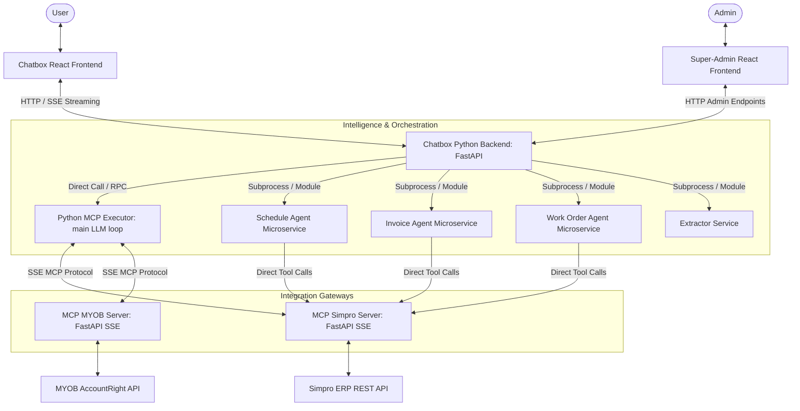
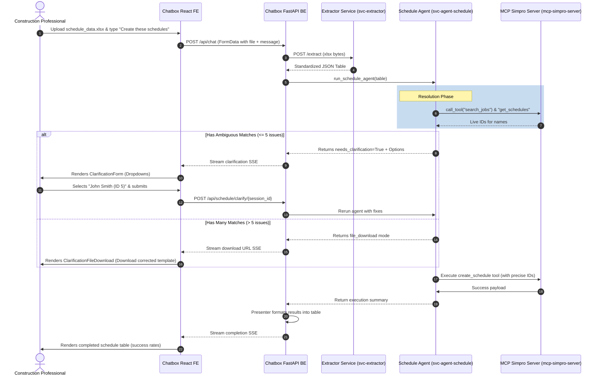

# Optificial.AI Codebase & Architecture Exploration

This document provides a comprehensive map of the Optificial.AI project, explaining the roles, locations, and integration points of all frontend, backend, and microservice components. It details the active production paths, legacy systems, and explains the presence of empty/skeleton placeholder files.

---

## 🏗️ High-Level System Architecture

Optificial.AI is an AI-powered back-office assistant tailored for construction companies. It integrates natural language instructions and file uploads with ERP and accounting systems (primarily **Simpro** and **MYOB AccountRight**).

The system employs a **hybrid orchestration model**:
1. **Standard Read/Write Queries (MCP Path):** Handled by the Python MCP Executor loop. The LLM decomposes user intent, retrieves the schemas of available tools, enforces token budgets, checks sufficiency, and executes tools against the SSE-based Simpro or MYOB servers.
2. **Complex Task Workflows (Agent Path):** Diverted to dedicated microservices (Schedule, Invoice, Work Order) containing specialized business rules (SOPs), multi-row Excel parsing, and stateful multi-turn clarification handling.

---

## 💻 Frontend Applications

The codebase contains two React-based frontend projects built with Vite, located in the root directory:

### 1. Main User Assistant (`Chatbox_mcp/frontend/`)
This is the primary chat interface where construction professionals query records, upload scheduling lists, or claim progress invoices.

*   **[App.jsx](file:///c:/Users/91970/Downloads/Optificial.AI-master/Optificial.AI-master/Chatbox_mcp/frontend/src/App.jsx):** Controls session initialization, validates user tokens, handles logout, and swaps between the Login page and the main Chat Box workspace.
*   **[components/ChatBox.jsx](file:///c:/Users/91970/Downloads/Optificial.AI-master/Optificial.AI-master/Chatbox_mcp/frontend/src/components/ChatBox.jsx):** The layout controller. Manages streaming messages, file upload drop zones, loading state animations, and the main chat window.
*   **[components/ClarificationForm.jsx](file:///c:/Users/91970/Downloads/Optificial.AI-master/Optificial.AI-master/Chatbox_mcp/frontend/src/components/ClarificationForm.jsx):** An interactive dropdown form presented in-chat when an agent encounters ambiguous names (e.g., matching multiple technicians) or missing required fields (e.g., job sections). It supports free-text overrides, dropdown selection, multiple choice, and confirmation dialogues.
*   **[components/ClarificationFileDownload.jsx](file:///c:/Users/91970/Downloads/Optificial.AI-master/Optificial.AI-master/Chatbox_mcp/frontend/src/components/ClarificationFileDownload.jsx):** Triggered when an operation contains too many errors (usually $>5$). Instead of cluttering the UI, it provides a download link for a pre-filled Excel spreadsheet with error highlights for the user to edit and re-upload.
*   **[components/RenderBlock.jsx](file:///c:/Users/91970/Downloads/Optificial.AI-master/Optificial.AI-master/Chatbox_mcp/frontend/src/components/RenderBlock.jsx):** Renders custom tables, visual layouts, and structured blocks returned by the presenter API.
*   **[components/ThinkingPanel.jsx](file:///c:/Users/91970/Downloads/Optificial.AI-master/Optificial.AI-master/Chatbox_mcp/frontend/src/components/ThinkingPanel.jsx):** Displays the step-by-step thinking plan, current tool calls, and sufficiency checks to make the agent's logic transparent.
*   **[components/AdminPanel.jsx](file:///c:/Users/91970/Downloads/Optificial.AI-master/Optificial.AI-master/Chatbox_mcp/frontend/src/components/AdminPanel.jsx):** Contains tenant configuration screens, API keys, and connection statuses for connected ERPs.

### 2. Global Tenant Dashboard (`superadmin-frontend/`)
Used by platform owners to manage organizations, tenant licenses, database configurations, and synchronization logs.

*   **[App.jsx](file:///c:/Users/91970/Downloads/Optificial.AI-master/Optificial.AI-master/superadmin-frontend/src/App.jsx):** Navigation wrapper for the admin platform.
*   **[pages/TenantListPage.jsx](file:///c:/Users/91970/Downloads/Optificial.AI-master/Optificial.AI-master/superadmin-frontend/src/pages/TenantListPage.jsx):** Lists all registered tenants/organizations.
*   **[pages/TenantDetailPage.jsx](file:///c:/Users/91970/Downloads/Optificial.AI-master/Optificial.AI-master/superadmin-frontend/src/pages/TenantDetailPage.jsx):** A management console showing tenant users, Simpro and MYOB credential setups, sync histories, and department-to-cost-centre mappings.
*   **[pages/CreateTenantPage.jsx](file:///c:/Users/91970/Downloads/Optificial.AI-master/Optificial.AI-master/superadmin-frontend/src/pages/CreateTenantPage.jsx):** Form to register a new tenant.
*   **[pages/PlatformSettingsPage.jsx](file:///c:/Users/91970/Downloads/Optificial.AI-master/Optificial.AI-master/superadmin-frontend/src/pages/PlatformSettingsPage.jsx):** Configures database connections, global API keys, and default LLM provider configurations.

---

## ⚙️ Backend & Orchestration

The core intelligence layer lives under `Chatbox_mcp/backend/`. It is built as a FastAPI Python backend.

### 1. Service Entry & API Routing
*   **[main.py](file:///c:/Users/91970/Downloads/Optificial.AI-master/Optificial.AI-master/Chatbox_mcp/backend/main.py):** Runs FastAPI, sets up CORS rules for frontends, runs one-time database department mapping migrations, and starts the background session cleaner.
*   **[api/chat.py](file:///c:/Users/91970/Downloads/Optificial.AI-master/Optificial.AI-master/Chatbox_mcp/backend/api/chat.py):** Orchestrates chat entries. Contains the router for prompt submissions, handles file uploads, redirects requests between agents and the MCP path, and coordinates multi-action chains.
*   **[api/auth_routes.py](file:///c:/Users/91970/Downloads/Optificial.AI-master/Optificial.AI-master/Chatbox_mcp/backend/api/auth_routes.py):** Deals with user signup, login, session states, and organization settings.
*   **[api/superadmin_routes.py](file:///c:/Users/91970/Downloads/Optificial.AI-master/Optificial.AI-master/Chatbox_mcp/backend/api/superadmin_routes.py):** Restricts access using `SUPERADMIN_TOKEN` to allow modifications to tenants and platform models.
*   **[api/agent_handoff.py](file:///c:/Users/91970/Downloads/Optificial.AI-master/Optificial.AI-master/Chatbox_mcp/backend/api/agent_handoff.py):** Provides a bridge to invoke Python-based microservices or executors from tool-calling prompts.

### 2. Main Executor (`Chatbox_mcp/backend/mcp_python_executor.py`)
This file is the main driver of the LLM tool loop. Originally, this orchestration loop ran inside a Node.js client (`mcp-client`), but it has been refactored into this Python script (controlled by the feature flag `USE_PYTHON_EXECUTOR=true` in `.env`). 
*   It generates query plans, enforces token budgets, checks data sufficiency, compresses tool result outputs, and handles fuzzy entity mapping in real-time.

### 3. Orchestration & LLM Utilities (`Chatbox_mcp/backend/utils/`)
*   **`llm_streaming.py`:** Handles connection streams with OpenAI and Anthropic, yielding chunk-by-chunk tokens or tool call structures.
*   **`entity_resolver.py`:** Handles mapping messy text inputs into explicit IDs (e.g., matching a contractor name to their Simpro Vendor ID).
*   **`fuzzy_match.py`:** Standard Levenshtein/Jaro-Winkler string similarity matching logic.
*   **`query_planner.py`:** Translates a natural language question into discrete, dependency-mapped steps to hit the fewest endpoint queries possible.
*   **`sufficiency_checker.py`:** Evaluates if the collected tool responses are enough to answer the user request or if another API turn is needed.
*   **`token_budget.py`:** Establishes context windows, measures prompt tokens, and trims conversation history to prevent model overflow.
*   **`tool_result_compressor.py`:** Performs 4-tiered data compression on massive API responses (e.g., summarising 200 invoice rows into stats and 5 samples) to save tokens.
*   **`tool_response_fields.py`:** Hardcoded registry detailing which columns are available for each tool, enabling the LLM to format filters.
*   **`crossroads.py`:** Handles human-in-the-loop decisions, storing temporary task states.
*   **`decision_journal.py`:** Records trace pathways and LLM outcomes for audit logging.

### 4. Client Proxies (`Chatbox_mcp/backend/agents/`)
Contains proxies (`invoice_proxy.py`, `schedule_proxy.py`, `workorder_proxy.py`) that map to the standalone microservices (`svc-agent-*`). They initialize executor contexts and communicate with the microservices via RPC/process boundaries.

### 5. Legacy Node.js Orchestrator (`Chatbox_mcp/mcp-client/`)
This was the original Javascript client that executed the LLM tool calling loop, routing tools to Simpro/MYOB via the SSE server.
> [!NOTE]
> This folder is **deprecated** but kept as a fallback. It is feature-flagged off when `USE_PYTHON_EXECUTOR=true` is set in the backend environment.

---

## 🔌 Integration Gateways (MCP Servers)

These servers act as SSE-based Model Context Protocol (MCP) gateways. They translate standard MCP tool calls (`list_tools`, `call_tool`) into REST API requests.

### 1. Simpro Gateway (`mcp-simpro-server/`)
*   **[src/main.py](file:///c:/Users/91970/Downloads/Optificial.AI-master/Optificial.AI-master/mcp-simpro-server/src/main.py):** Boots the FastAPI application using SSE transport for MCP.
*   **`src/mcp_core/`:** Implements the Model Context Protocol (protocol parser, SSE connection handling, and JSON-RPC dispatching).
*   **`src/simpro/client.py`:** Lower-level authenticated HTTP client that handles rate limits, tenant tokens, and company headers.
*   **`src/tools/`:** Individual modules mapping Simpro endpoints to MCP schemas. For example, [schedules.py](file:///c:/Users/91970/Downloads/Optificial.AI-master/Optificial.AI-master/mcp-simpro-server/src/tools/schedules.py) exposes tools like `get_schedules`, `create_schedule`, and `delete_schedule`.

### 2. MYOB Gateway (`mcp-myob-server/`)
Follows the same architecture as the Simpro server, wrapping the MYOB AccountRight API.
*   **`src/tools/`:** Bridges MYOB client functions to MCP schemas. Covers banking, sales, general ledger, payroll, contacts, and purchases.

---

## 🤖 Standalone Microservices (Agents)

Optificial splits logic-heavy, rule-based operations into independent microservices.

### 1. Document Extractor (`svc-extractor/`)
Provides layout analysis and extracts tables from PDF and Excel files.
*   **[src/extractor_engine.py](file:///c:/Users/91970/Downloads/Optificial.AI-master/Optificial.AI-master/svc-extractor/src/extractor_engine.py):** Parses Excel templates or PDF invoice tables using rules and LLM vision/text parsers, returning standardized JSON tables.

### 2. Invoice Agent (`svc-agent-invoice/`)
Groups and claims invoices based on company SOPs.
*   **[src/invoice_agent.py](file:///c:/Users/91970/Downloads/Optificial.AI-master/Optificial.AI-master/svc-agent-invoice/src/invoice_agent.py):** Uses sheet comprehension to map arbitrary spreadsheet columns, filters out invalid rows, groups claims by job/cost-centre/item, validates them against the company's invoice SOP, and pushes them to Simpro.

### 3. Purchase Order Agent (`svc-agent-purchase-order/`)
*   **[src/po_agent.py](file:///c:/Users/91970/Downloads/Optificial.AI-master/Optificial.AI-master/svc-agent-purchase-order/src/po_agent.py):** Automatically generates and validates POs inside Simpro.

### 4. Schedule Agent (`svc-agent-schedule/`)
Manages bulk technician rosters.
*   **[src/schedule_agent.py](file:///c:/Users/91970/Downloads/Optificial.AI-master/Optificial.AI-master/svc-agent-schedule/src/schedule_agent.py):** Runs a hybrid planning strategy. Uses an LLM to generate a field resolution plan, then executes ID resolution (e.g. mapping "John" to a StaffID on a specific date) deterministically across all rows in parallel.

### 5. Work Order Agent (`svc-agent-workorder/`)
Handles subcontractor assignments using a secure two-phase process.
*   **[src/wo_agent.py](file:///c:/Users/91970/Downloads/Optificial.AI-master/Optificial.AI-master/svc-agent-workorder/src/wo_agent.py):**
    *   **Phase A (Prepare):** Fetches the materials and labor items in a cost centre and writes them to a downloadable Excel sheet.
    *   **Phase B (Create):** Parses the re-uploaded sheet containing the user's modifications (such as quantities and item selections) and generates the contractor job inside Simpro.

---

## 🕳️ Empty and Placeholder Files

You will notice several empty (0 bytes) or stub files in the codebase. This is by design, resulting from architectural refactoring:

### 1. `mcp-simpro-server/src/agents/`
*   **Empty Files:** `extractor_agent.py`, `invoice_agent.py`, `workorder_agent.py`
*   **Stub Files:** `base.py` (contains only a comment `#mcp-simpro-server/src/agents`)
*   **Reason:** Early in the project's lifecycle, the agents were planned to run directly inside the integration server. This was refactored to separate the integration server from the agent logic, moving these modules to standalone services (`svc-agent-invoice`, `svc-agent-workorder`, etc.). The empty files were kept as module namespace placeholders.

### 2. `mcp-simpro-server/src/simpro/api/`
*   **Empty Files:** `customers.py`, `staff.py`
*   **Stub Files:** `employees.py` (contains only a comment docstring)
*   **Reason:** The Simpro client wraps standard endpoints. In cases where the MCP tool implementations ([mcp-simpro-server/src/tools/employees.py](file:///c:/Users/91970/Downloads/Optificial.AI-master/Optificial.AI-master/mcp-simpro-server/src/tools/employees.py)) make direct client queries using the base HTTP wrapper `client.get()`, a dedicated sub-API class was redundant. These files remain as skeletons for future API extensions.

---

## 🔄 Interaction Flow: The Lifecycle of a File Upload

Here is how the components interact when a user uploads a scheduling Excel file:

