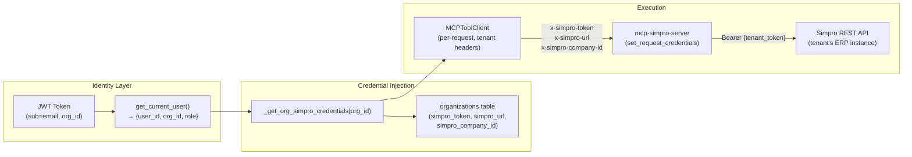
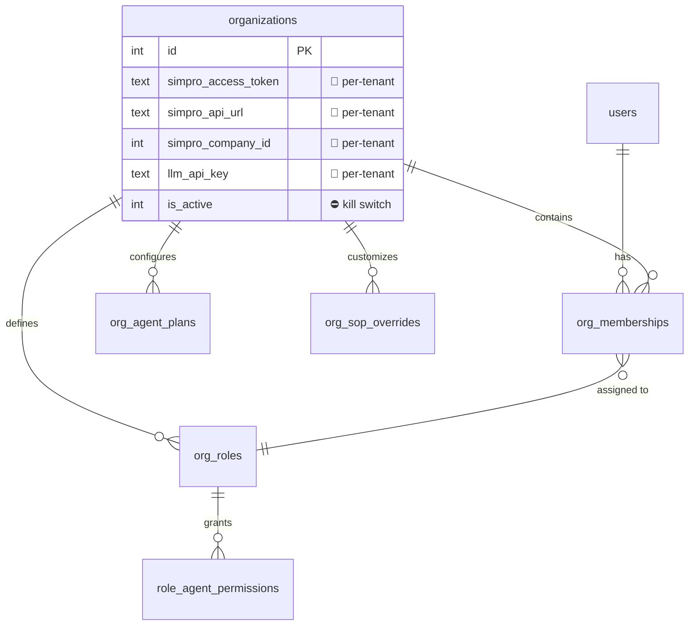
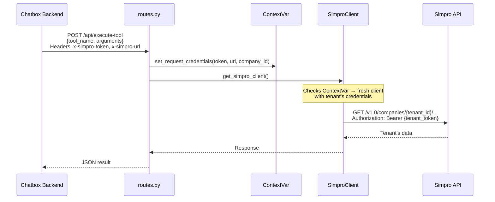

# Optificial.AI — Tenant-Level Isolation Analysis

> **Scope:** Every folder in the project, analysed for how tenant (organisation) boundaries are enforced.  
> **Method:** Static code analysis — imports, data-flow tracing, credential propagation, and session scoping.

---

## Table of Contents

1. [Executive Summary](#executive-summary)
2. [Chatbox_mcp / Frontend](#1-chatbox_mcp--frontend)
3. [Chatbox_mcp / Backend — Auth & Database](#2-chatbox_mcp--backend--auth--database)
4. [Chatbox_mcp / Backend — API Layer (chat.py, auth_routes.py)](#3-chatbox_mcp--backend--api-layer)
5. [Chatbox_mcp / Backend — Agent Proxies](#4-chatbox_mcp--backend--agent-proxies)
6. [Chatbox_mcp / Backend — Python MCP Executor](#5-chatbox_mcp--backend--python-mcp-executor)
7. [Chatbox_mcp / Backend — Utils](#6-chatbox_mcp--backend--utils)
8. [mcp-simpro-server](#7-mcp-simpro-server)
9. [mcp-myob-server](#8-mcp-myob-server)
10. [svc-agent-schedule](#9-svc-agent-schedule)
11. [svc-agent-invoice](#10-svc-agent-invoice)
12. [svc-agent-workorder](#11-svc-agent-workorder)
13. [svc-agent-purchase-order](#12-svc-agent-purchase-order)
14. [svc-extractor](#13-svc-extractor)
15. [superadmin-frontend](#14-superadmin-frontend)
16. [Chatbox_mcp / mcp-client (Legacy)](#15-chatbox_mcp--mcp-client-legacy)
17. [Overall Risk Assessment & Recommendations](#overall-risk-assessment)

---

## Executive Summary

Optificial.AI implements a **request-scoped, credential-forwarding** multi-tenancy model. Tenant isolation is primarily achieved by:

1. **JWT-based identity** — every request carries a JWT that resolves to a `user_id` → `org_id`.
2. **Per-request credential injection** — each org's Simpro API credentials (`token`, `url`, `company_id`) are loaded from the DB and forwarded as HTTP headers to MCP servers.
3. **Per-request executor instances** — `PythonMCPExecutor` and `MCPToolClient` are instantiated per-request with tenant-specific credentials rather than using global singletons.



> [!IMPORTANT]
> **Overall Verdict: Good foundation, with specific gaps.** The credential-forwarding design is sound. The main risks are: (a) a shared global reference-data cache in `mcp_executor.py` that is **not** keyed by org, (b) in-memory session stores (`_user_contexts`, `_pending_sessions`) keyed by user_id but **not** org_id, and (c) the MYOB server having **no** multi-tenant credential injection at all.

---

## 1. Chatbox_mcp / Frontend

**Key files:** [App.jsx](file:///C:/Users/91970/Downloads/Optificial.AI-master/Optificial.AI-master/Chatbox_mcp/frontend/src/App.jsx), [ChatBox.jsx](file:///C:/Users/91970/Downloads/Optificial.AI-master/Optificial.AI-master/Chatbox_mcp/frontend/src/components/ChatBox.jsx)

### How Isolation Works

| Mechanism | Implementation | Verdict |
|-----------|---------------|---------|
| **Auth token storage** | JWT stored in `localStorage`; sent as `Authorization: Bearer` on every request | ✅ Standard |
| **Session validation** | `GET /api/auth/me` on mount validates token, extracts `org_id` server-side | ✅ Good |
| **Data scoping** | Frontend never stores `org_id` itself — it comes back from the server in every response | ✅ Good |
| **Cross-tenant data leakage** | No direct Simpro API calls from frontend — all routed through backend | ✅ Good |

### Gaps

- **None significant.** The frontend is a pure rendering client. All tenant boundary enforcement happens server-side. The frontend trusts the backend's scoped responses.

### Isolation Rating: 🟢 Strong

---

## 2. Chatbox_mcp / Backend — Auth & Database

**Key files:** [auth.py](file:///C:/Users/91970/Downloads/Optificial.AI-master/Optificial.AI-master/Chatbox_mcp/backend/auth/auth.py), [database.py](file:///C:/Users/91970/Downloads/Optificial.AI-master/Optificial.AI-master/Chatbox_mcp/backend/auth/database.py)

### How Isolation Works

| Mechanism | Implementation | Verdict |
|-----------|---------------|---------|
| **User→Org mapping** | `org_memberships` table (M:N, typically 1:1) links `user_id` → `org_id` | ✅ |
| **JWT payload** | Contains `sub` (email), but `org_id` is resolved server-side via `get_user_org()` — not trusted from token | ✅ Secure |
| **Org deactivation** | `organizations.is_active` flag checked at login + every `get_current_user()` call | ✅ |
| **Member deactivation** | `org_memberships.is_active` flag with audit trail (`deactivated_at`, `deactivated_by_user_id`) | ✅ |
| **Credential storage** | Per-org: `simpro_access_token`, `simpro_api_url`, `simpro_company_id` stored in `organizations` table | ✅ |
| **LLM key isolation** | Per-org LLM override columns (`llm_provider`, `llm_model`, `llm_api_key`) with `use_platform_llm` toggle | ✅ |
| **Usage tracking** | `usage_records` table has `org_id` + `user_id` columns; queries always filter by `org_id` | ✅ |
| **RBAC** | Per-org custom roles (`org_roles`), per-role agent permissions (`role_agent_permissions`) | ✅ |
| **SOP overrides** | `org_sop_overrides` table keyed by `(org_id, agent_name)` | ✅ |
| **Department mapping** | `organizations.department_mapping` JSON column — per-org | ✅ |
| **Password hashing** | bcrypt via `passlib` | ✅ |

### Schema Isolation Model



### Gaps

> [!WARNING]
> **Shared SQLite database** — All orgs share a single `users.db` file. There is no row-level security enforced at the DB engine level. Isolation is enforced purely at the application layer (SQL `WHERE org_id = ?` clauses). This is acceptable for the current scale but would need migration to PostgreSQL with RLS for enterprise deployments.

### Isolation Rating: 🟢 Strong (application-level isolation is thorough)

---

## 3. Chatbox_mcp / Backend — API Layer

**Key files:** [chat.py](file:///C:/Users/91970/Downloads/Optificial.AI-master/Optificial.AI-master/Chatbox_mcp/backend/api/chat.py), [auth_routes.py](file:///C:/Users/91970/Downloads/Optificial.AI-master/Optificial.AI-master/Chatbox_mcp/backend/api/auth_routes.py), [superadmin_routes.py](file:///C:/Users/91970/Downloads/Optificial.AI-master/Optificial.AI-master/Chatbox_mcp/backend/api/superadmin_routes.py)

### How Isolation Works

| Mechanism | Implementation | Verdict |
|-----------|---------------|---------|
| **Auth dependency** | Every protected endpoint uses `Depends(get_current_user)` which extracts `org_id` from the JWT→DB chain | ✅ |
| **Credential loading** | `_get_org_simpro_credentials(org_id)` loads from DB per-request (L408–427 in chat.py) | ✅ |
| **Credential forwarding to agents** | Injected into `hints` dict: `hints["simpro_token"]`, `hints["simpro_url"]`, `hints["simpro_company_id"]` (L1362–1369) | ✅ |
| **Credential forwarding to MCP path** | `_org_creds` passed to `PythonMCPExecutor` constructor (L2162, L3020) | ✅ |
| **LLM key routing** | `_get_org_llm_config(org_id)` resolves per-org or platform-global LLM keys per request | ✅ |
| **Agent enable/disable** | `is_agent_enabled_for_org(org_id, agent_name)` checked before routing to any agent | ✅ |
| **Operation permissions** | `is_operation_allowed_for_user(user_id, org_id, agent, operation)` RBAC check | ✅ |
| **Token budget** | `_check_token_budget(org_id)` and `_check_agent_token_budget(org_id, agent)` per-org enforcement | ✅ |
| **Usage logging** | `log_usage(org_id, user_id, agent, tokens, ...)` always includes `org_id` | ✅ |
| **Superadmin protection** | `require_superadmin` dependency checks `SUPERADMIN_TOKEN` env var — completely separate from user JWT | ✅ |

### Gaps

> [!WARNING]
> **In-memory session stores are not org-scoped:**
> - `_user_contexts: Dict[int, ...]` — keyed by `user_id`, not `(user_id, org_id)`. If a user belongs to multiple orgs (the schema allows M:N), their context could bleed.
> - `_pending_sessions: Dict[str, ...]` — clarification sessions keyed by UUID. Safe in isolation, but the session data includes extracted file tables which could theoretically be accessed if a session_id is guessed/leaked.
> - `_last_failed_ops: Dict[int, ...]` — retry cache keyed by `user_id` only.

> [!NOTE]
> **Practical risk is LOW** because `org_memberships` currently enforces 1:1 user→org, and session IDs are UUIDs. But if multi-org membership is enabled in the future, these stores need `(user_id, org_id)` compound keys.

### Isolation Rating: 🟡 Good (minor in-memory scoping gaps)

---

## 4. Chatbox_mcp / Backend — Agent Proxies

**Key files:** [schedule_proxy.py](file:///C:/Users/91970/Downloads/Optificial.AI-master/Optificial.AI-master/Chatbox_mcp/backend/agents/schedule_proxy.py), [invoice_proxy.py](file:///C:/Users/91970/Downloads/Optificial.AI-master/Optificial.AI-master/Chatbox_mcp/backend/agents/invoice_proxy.py), [workorder_proxy.py](file:///C:/Users/91970/Downloads/Optificial.AI-master/Optificial.AI-master/Chatbox_mcp/backend/agents/workorder_proxy.py), [purchase_order_proxy.py](file:///C:/Users/91970/Downloads/Optificial.AI-master/Optificial.AI-master/Chatbox_mcp/backend/agents/purchase_order_proxy.py)

### How Isolation Works

All four proxies follow an **identical tenant isolation pattern**:

```python
# From schedule_proxy.py (L137-144) — same pattern in all proxies
_token = hints.get("simpro_token") if hints else None
_url   = hints.get("simpro_url")   if hints else None
_cid   = hints.get("simpro_company_id") if hints else None

if _token and _url:
    mcp_client = MCPToolClient(simpro_token=_token, simpro_url=_url, simpro_company_id=_cid)
else:
    mcp_client = get_mcp_tool_client()  # ← fallback to global singleton (dev mode)
```

| Mechanism | Implementation | Verdict |
|-----------|---------------|---------|
| **Per-tenant MCP client** | `MCPToolClient(simpro_token=..., simpro_url=..., simpro_company_id=...)` — fresh instance per request | ✅ |
| **Fallback isolation** | If no org creds → uses global `.env` creds (dev/single-tenant mode only) | ⚠️ Acceptable |
| **PII filtering** | `_safe_llm_chat()` wraps all LLM calls through `sanitize_for_llm()` | ✅ |
| **SOP override** | Per-org SOP loaded from DB: `get_org_sop(org_id, agent_name)` (Phase 5) | ✅ |
| **Company ID** | Extracted from `hints["CompanyID"]` (originally from `current_user["simpro_company_id"]`) | ✅ |

### Gaps

> [!NOTE]
> **Fallback to global singleton is intentional** for local dev without org credentials. In production, every org should have credentials configured. The code logs a clear message when this happens.

### Isolation Rating: 🟢 Strong

---

## 5. Chatbox_mcp / Backend — Python MCP Executor

**Key file:** [mcp_python_executor.py](file:///C:/Users/91970/Downloads/Optificial.AI-master/Optificial.AI-master/Chatbox_mcp/backend/mcp_python_executor.py)

### How Isolation Works

| Mechanism | Implementation | Verdict |
|-----------|---------------|---------|
| **Per-request instances** | `get_python_executor()` creates a **new** `PythonMCPExecutor` per request with `org_id`, `simpro_token`, `simpro_url`, `simpro_company_id`, `llm_provider`, `llm_model`, `llm_api_key` | ✅ Excellent |
| **MCPToolClient caching** | `_mcp_client_cache` keyed by `(simpro_url, simpro_token)` — different orgs get different clients | ✅ |
| **Entity resolver scoping** | `EntityResolver(mcp_executor=..., org_id=self.org_id)` — resolver is bound to the per-request MCP executor | ✅ |
| **LLM call routing** | Uses `self._llm_provider`, `self._llm_model`, `self._llm_api_key` set at construction — per-org | ✅ |

### Gaps

> [!WARNING]
> **`_mcp_client_cache` is a module-level dict that is never evicted.** Over time with many tenants, this grows unboundedly. Each entry holds an `MCPToolClient` with an `httpx.AsyncClient` and a tools cache. Not a security issue but an operational concern — stale credentials won't be refreshed until the process restarts.

### Isolation Rating: 🟢 Strong

---

## 6. Chatbox_mcp / Backend — Utils

**Key files:** [mcp_tool_client.py](file:///C:/Users/91970/Downloads/Optificial.AI-master/Optificial.AI-master/Chatbox_mcp/backend/utils/mcp_tool_client.py), [mcp_executor.py](file:///C:/Users/91970/Downloads/Optificial.AI-master/Optificial.AI-master/Chatbox_mcp/backend/utils/mcp_executor.py), [department_cache.py](file:///C:/Users/91970/Downloads/Optificial.AI-master/Optificial.AI-master/Chatbox_mcp/backend/utils/department_cache.py), [entity_resolver.py](file:///C:/Users/91970/Downloads/Optificial.AI-master/Optificial.AI-master/Chatbox_mcp/backend/utils/entity_resolver.py)

### `mcp_tool_client.py` — Credential Header Forwarding

The `MCPToolClient._credential_headers()` method (L142–150) builds per-tenant headers:

```python
def _credential_headers(self) -> Dict[str, str]:
    headers: Dict[str, str] = {}
    if self._simpro_token and self._simpro_url:
        headers["x-simpro-token"] = self._simpro_token
        headers["x-simpro-url"]   = self._simpro_url
        if self._simpro_company_id is not None:
            headers["x-simpro-company-id"] = str(self._simpro_company_id)
    return headers
```

These headers are sent on every `execute_tool()` call (L169). **This is the primary tenant isolation mechanism for the Simpro integration.**

### `mcp_executor.py` — Global Reference Data Cache

> [!CAUTION]
> **The `_global_cache` in `mcp_executor.py` (L62) is a module-level dict that is NOT keyed by org_id or tenant credentials.** The cache key is `{tool_name}::{json.dumps(params)}`. This means:
>
> - If Org A calls `list_employees` and the result is cached globally for 5 minutes…
> - …then Org B calling `list_employees` with the same params could receive Org A's employee list.
>
> **This is the most significant tenant isolation gap in the codebase.**
>
> The per-request cache (`self._result_cache`) is safe because each `MCPToolExecutor` instance is request-scoped. But the **global TTL cache** (`_GLOBAL_CACHEABLE` set: `list_employees`, `list_contractors`, `get_cost_centre_types`, `get_setup_cost_centres`, `get_chart_of_accounts`) is shared across all tenants.

### `entity_resolver.py` & `department_cache.py`

- `EntityResolver` receives an `org_id` at construction and its `mcp_executor` is already tenant-scoped ✅
- `department_cache.py` caches are keyed by `org_id` ✅

### Isolation Rating: 🔴 **Critical gap in global reference cache**

---

## 7. mcp-simpro-server

**Key files:** [routes.py](file:///C:/Users/91970/Downloads/Optificial.AI-master/Optificial.AI-master/mcp-simpro-server/src/api/routes.py), [client.py](file:///C:/Users/91970/Downloads/Optificial.AI-master/Optificial.AI-master/mcp-simpro-server/src/simpro/client.py), [auth.py](file:///C:/Users/91970/Downloads/Optificial.AI-master/Optificial.AI-master/mcp-simpro-server/src/simpro/auth.py)

### How Isolation Works

| Mechanism | Implementation | Verdict |
|-----------|---------------|---------|
| **Per-request credential injection** | `execute_tool()` endpoint reads `x-simpro-token`, `x-simpro-url`, `x-simpro-company-id` from request headers (L152–157) | ✅ |
| **ContextVar-based scoping** | `set_request_credentials()` uses Python `ContextVar` to set tenant creds for the current async context | ✅ Excellent |
| **Per-tenant client creation** | `get_simpro_client()` returns a **fresh** `SimproClient` when `ContextVar` creds are set, falls back to global singleton only when they're not | ✅ |
| **Per-tenant rate limiting** | `RateLimiter` uses `_get_tenant_key()` which extracts company ID from URL — rate limits are **per-tenant** | ✅ Excellent |
| **Auth header construction** | `SimproAuth` accepts `access_token`, `company_id`, `base_url` — each tenant's Simpro API gets its own Bearer token | ✅ |

### Request Flow



### Gaps

> [!WARNING]
> **`get_simpro_client()` returns a fresh (uncached) client per-request in multi-tenant mode.** While this guarantees isolation, it means a new `httpx.AsyncClient` is created per request. This is not a security issue but has performance implications — connection pooling benefits are lost. The backend's `_mcp_client_cache` partially mitigates this by reusing clients keyed by `(url, token)`.

### Isolation Rating: 🟢 Strong

---

## 8. mcp-myob-server

**Key files:** [client.py](file:///C:/Users/91970/Downloads/Optificial.AI-master/Optificial.AI-master/mcp-myob-server/src/myob/client.py)

### How Isolation Works

| Mechanism | Implementation | Verdict |
|-----------|---------------|---------|
| **Client instance** | Global singleton via `get_myob_client()` — **no per-tenant credential injection** | ❌ |
| **Auth** | `MyOBAuth()` uses `.env` / `settings` for OAuth2 credentials — single set of creds | ❌ |
| **Rate limiting** | Per API key, not per tenant — matches MYOB's own rate limit model | ⚠️ |

### Gaps

> [!CAUTION]
> **The MYOB server has NO multi-tenant support at all.** There is:
> - No equivalent of `set_request_credentials()` or `x-simpro-*` headers
> - No `ContextVar` for per-request credentials
> - No per-tenant client creation
> - A single global OAuth2 token used for all requests
>
> This means **all tenants share the same MYOB company file.** If different tenants need different MYOB instances, this is a **critical gap**.

> [!NOTE]
> If MYOB is currently only used by a single tenant or all tenants share the same MYOB company file, this is acceptable. But it must be addressed before onboarding tenants with separate MYOB instances.

### Isolation Rating: 🔴 **No tenant isolation**

---

## 9. svc-agent-schedule

**Key file:** [schedule_agent.py](file:///C:/Users/91970/Downloads/Optificial.AI-master/Optificial.AI-master/svc-agent-schedule/src/schedule_agent.py) (210KB)

### How Isolation Works

The schedule agent is a **library** (not a standalone HTTP service). It has no direct knowledge of tenants. Isolation is achieved through the proxy pattern:

```
chat.py → schedule_proxy.py → MCPToolClient(tenant creds) → mcp-simpro-server
```

| Mechanism | Implementation | Verdict |
|-----------|---------------|---------|
| **No direct API calls** | Agent calls tools through `mcp_executor.call_tool()` which is backed by a tenant-scoped `MCPToolClient` | ✅ |
| **No org_id awareness** | Agent does not import or reference `org_id` — completely oblivious to tenancy | ✅ Clean separation |
| **LLM calls** | Receives `llm_chat` function from proxy — already wrapped with per-org API key routing | ✅ |
| **SOP injection** | Receives `hints["sop_override"]` from proxy if org has custom SOP | ✅ |
| **CompanyID** | Receives `hints["CompanyID"]` — used to build Simpro API paths (e.g., `/companies/{id}/schedules`) | ✅ |

### Gaps

- **None.** The agent is tenant-agnostic by design — all tenant-specific behaviour is injected by the proxy layer.

### Isolation Rating: 🟢 Strong (by design — delegated to proxy)

---

## 10. svc-agent-invoice

**Key file:** [invoice_agent.py](file:///C:/Users/91970/Downloads/Optificial.AI-master/Optificial.AI-master/svc-agent-invoice/src/invoice_agent.py) (132KB)

### How Isolation Works

Identical pattern to the schedule agent — library invoked through [invoice_proxy.py](file:///C:/Users/91970/Downloads/Optificial.AI-master/Optificial.AI-master/Chatbox_mcp/backend/agents/invoice_proxy.py).

| Mechanism | Implementation | Verdict |
|-----------|---------------|---------|
| **Proxy-injected MCP client** | Tenant-scoped `MCPToolClient` created in proxy, passed as `mcp_executor` | ✅ |
| **LLM routing** | `llm_chat` function from proxy wraps per-org API key | ✅ |
| **SOP override** | `hints["sop_override"]` injected from DB if available | ✅ |
| **PII filtering** | `_safe_llm_chat()` sanitizes all data before sending to LLM | ✅ |

### Gaps

- **None.** Same clean separation as the schedule agent.

### Isolation Rating: 🟢 Strong

---

## 11. svc-agent-workorder

**Key file:** [wo_agent.py](file:///C:/Users/91970/Downloads/Optificial.AI-master/Optificial.AI-master/svc-agent-workorder/src/wo_agent.py)

### How Isolation Works

Same proxy pattern via [workorder_proxy.py](file:///C:/Users/91970/Downloads/Optificial.AI-master/Optificial.AI-master/Chatbox_mcp/backend/agents/workorder_proxy.py). The work order agent has a two-phase flow (Prepare → Create), but both phases use the same tenant-scoped MCP client.

| Mechanism | Verdict |
|-----------|---------|
| Proxy-injected tenant credentials | ✅ |
| LLM routing through proxy | ✅ |
| Downloaded Excel files are per-session, per-user | ✅ |

### Isolation Rating: 🟢 Strong

---

## 12. svc-agent-purchase-order

**Key file:** [po_agent.py](file:///C:/Users/91970/Downloads/Optificial.AI-master/Optificial.AI-master/svc-agent-purchase-order/src/po_agent.py)

### How Isolation Works

Same proxy pattern via [purchase_order_proxy.py](file:///C:/Users/91970/Downloads/Optificial.AI-master/Optificial.AI-master/Chatbox_mcp/backend/agents/purchase_order_proxy.py).

| Mechanism | Verdict |
|-----------|---------|
| Proxy-injected tenant credentials | ✅ |
| LLM routing through proxy | ✅ |

### Isolation Rating: 🟢 Strong

---

## 13. svc-extractor

**Key files:** [extractor_engine.py](file:///C:/Users/91970/Downloads/Optificial.AI-master/Optificial.AI-master/svc-extractor/src/extractor_engine.py), [extractor_service.py](file:///C:/Users/91970/Downloads/Optificial.AI-master/Optificial.AI-master/svc-extractor/src/extractor_service.py)

### How Isolation Works

The extractor is a **stateless file-processing service**. It receives an uploaded file, extracts tables/text, and returns structured JSON. It has:

- **No org_id, no tenant awareness, no database access** — completely stateless
- **No Simpro credentials** — it does not make external API calls
- **No persistent storage** — file bytes are processed in-memory and discarded

| Mechanism | Verdict |
|-----------|---------|
| Stateless processing | ✅ Inherently isolated |
| No cross-request state | ✅ |
| No tenant data stored | ✅ |

### Gaps

- **None.** Stateless services are inherently tenant-isolated.

### Isolation Rating: 🟢 Strong (inherently)

---

## 14. superadmin-frontend

**Key files:** [App.jsx](file:///C:/Users/91970/Downloads/Optificial.AI-master/Optificial.AI-master/superadmin-frontend/src/App.jsx), [api.js](file:///C:/Users/91970/Downloads/Optificial.AI-master/Optificial.AI-master/superadmin-frontend/src/api.js)

### How Isolation Works

| Mechanism | Implementation | Verdict |
|-----------|---------------|---------|
| **Auth** | Uses `SUPERADMIN_TOKEN` (env var), **not** user JWT — completely separate auth realm | ✅ |
| **Cross-tenant access** | By design — superadmin can see and manage ALL tenants | ✅ Expected |
| **Backend protection** | All superadmin endpoints use `Depends(require_superadmin)` — regular user JWTs cannot access them | ✅ |
| **API key masking** | LLM API keys are never returned in full — only `api_key_set: true/false` | ✅ |

### Gaps

> [!NOTE]
> The `SUPERADMIN_TOKEN` is a static secret stored in `.env`. If leaked, an attacker gets full cross-tenant access. Consider rotating it periodically or replacing with a proper admin auth system for production.

### Isolation Rating: 🟢 Strong (appropriate for its purpose)

---

## 15. Chatbox_mcp / mcp-client (Legacy)

**Location:** `Chatbox_mcp/mcp-client/`

This is the **deprecated** Node.js MCP orchestrator. It is feature-flagged off when `USE_PYTHON_EXECUTOR=true`. Since it's inactive, tenant isolation analysis is not critical, but:

- It connects to `mcp-simpro-server` via SSE
- It does **not** have per-tenant credential forwarding (the SSE connection uses server-level `.env` credentials)
- This is one of the reasons it was replaced by the Python executor

### Isolation Rating: ⚪ N/A (deprecated, flagged off)

---

## Overall Risk Assessment

### Summary Table

| Component | Rating | Key Finding |
|-----------|--------|-------------|
| Frontend | 🟢 Strong | Pure rendering client, no direct API calls |
| Auth & Database | 🟢 Strong | Thorough per-org scoping in all queries |
| API Layer (chat.py) | 🟡 Good | In-memory stores keyed by user_id not (user_id, org_id) |
| Agent Proxies | 🟢 Strong | Consistent credential injection pattern |
| Python MCP Executor | 🟢 Strong | Per-request instances with full credential isolation |
| Utils (mcp_executor.py) | 🔴 **Critical** | Global reference cache not keyed by org/tenant |
| mcp-simpro-server | 🟢 Strong | ContextVar-based per-request credential injection |
| mcp-myob-server | 🔴 **Critical** | No multi-tenant support at all |
| svc-agent-schedule | 🟢 Strong | Tenant-agnostic, isolation via proxy |
| svc-agent-invoice | 🟢 Strong | Tenant-agnostic, isolation via proxy |
| svc-agent-workorder | 🟢 Strong | Tenant-agnostic, isolation via proxy |
| svc-agent-purchase-order | 🟢 Strong | Tenant-agnostic, isolation via proxy |
| svc-extractor | 🟢 Strong | Stateless, inherently isolated |
| superadmin-frontend | 🟢 Strong | Separate auth realm, API key masking |

### Top Recommendations

> [!CAUTION]
> **P0 — Fix global reference cache in `mcp_executor.py`**
>
> The `_global_cache` dict must include the tenant identity in the cache key. Simplest fix:
> ```python
> def _cache_key(self, tool_name: str, params: Dict[str, Any]) -> str:
>     # Include tenant identity to prevent cross-tenant cache pollution
>     tenant_id = getattr(self._client, '_simpro_url', '') or 'global'
>     return f"{tenant_id}::{tool_name}::{json.dumps(params, sort_keys=True, default=str)}"
> ```

> [!IMPORTANT]
> **P1 — Add multi-tenant support to mcp-myob-server**
>
> Mirror the Simpro server pattern: accept `x-myob-*` headers, use `ContextVar` for per-request credentials, and create per-tenant `MyOBClient` instances.

> [!WARNING]
> **P2 — Scope in-memory session stores by (user_id, org_id)**
>
> In `chat.py`, change `_user_contexts`, `_pending_sessions`, and `_last_failed_ops` to use compound keys if multi-org membership is ever enabled.

> [!NOTE]
> **P3 — Add cache eviction / TTL to `_mcp_client_cache`**
>
> In `mcp_python_executor.py`, the `_mcp_client_cache` grows unboundedly. Add LRU eviction or TTL-based cleanup so that stale tenant credentials don't persist indefinitely in memory.
